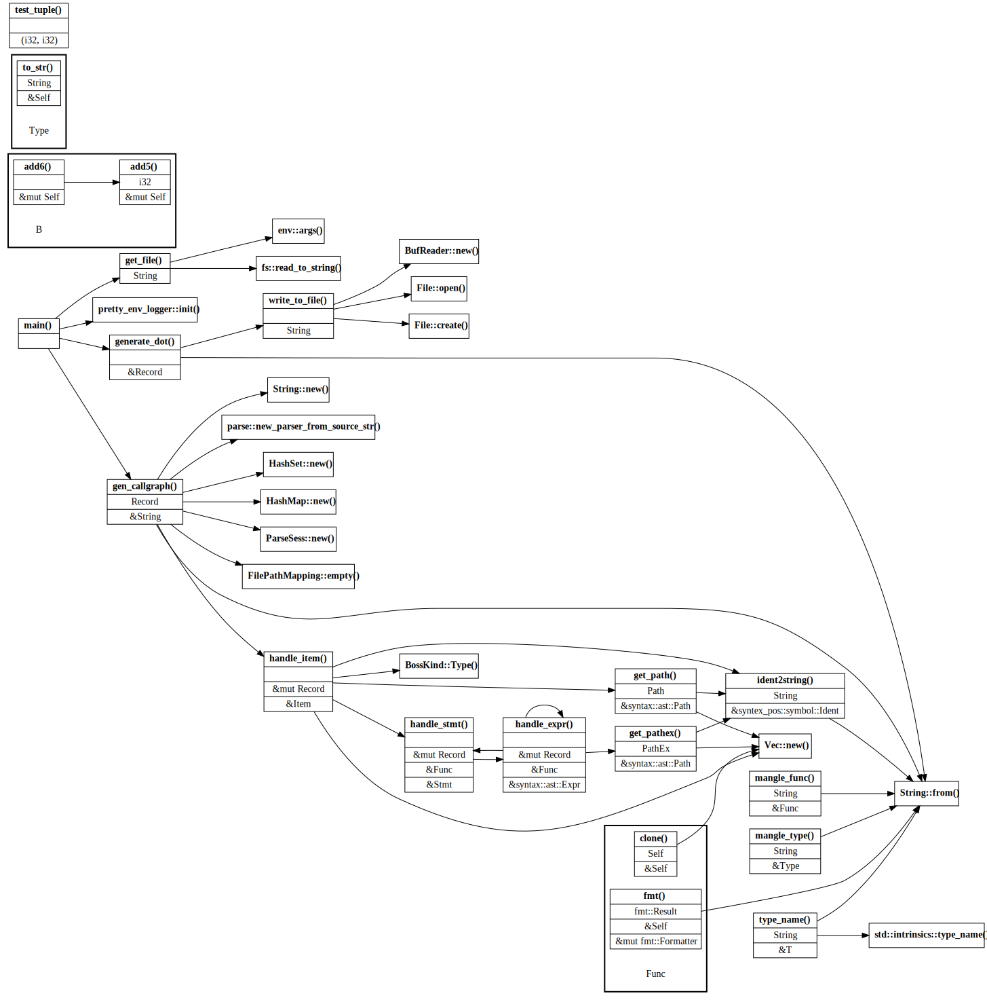

# Rust Call Graph

Static analysis(use `syntex_syntax`) to generate Rust codes' callgraph.


## Run Demo
```sh
$ ./run_demo.sh src/main.rs
input:  src/main.rs
dot:    output.dot
debug:  debug.log
output: src_main.svg
```

## Fixme
- [ ] Fail parsing `use crate::something;`
- [ ] Fail parsing `use std::io::{prelude::*, BufReader};`
- [ ] Derivation at the very least. eg 
    `fn func<F>(arg: F){ arg(p); }`, the correct result should be `F(p)` instead of `arg(p)`.
    

## Todolist
- [ ] UFCS
- [ ] Context of variable/type/crate
    - [ ] `let a:A;  a.f();` => `A::f()`
    - [x] ~~subgraph for type system~~
    - [ ] if `callee` couldn't be found inside `callers`, analysis it.
- [ ] TraitRef 
- [ ] Generics
  - [ ] generic function
  - [ ] generic type
  - [ ] generic impl
- [ ] Macro analysis
- [ ] Ignorelist
- [ ] Nested function


## Note
- [ ] Declare `enum Enum{ E1(T); }` and then use it like `e = Enum::E1(t)`, should it be considered as a function call?


## Current Result

